# Dots Room

**쓰지 않던 Android 태블릿에, 내 Dots가 머무는 작은 픽셀 공간을.**

[English](README.en.md) · [설치와 연결](docs/setup.md) · [내 캐릭터 만들기](docs/characters.md) · [검증 기록](docs/verification.md)

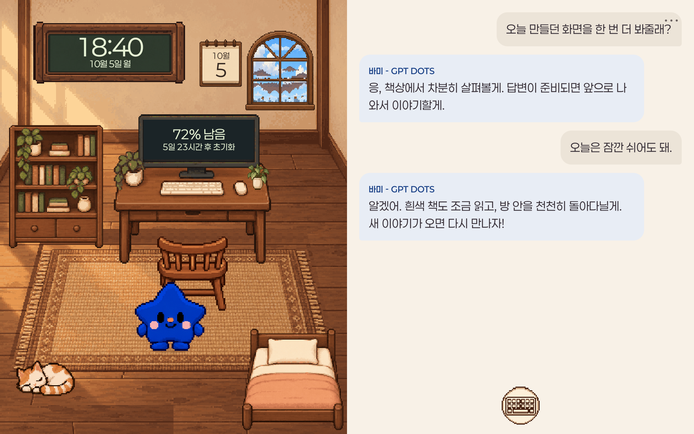

*모든 화면의 대화·메모·한도·날씨·시각은 고정된 합성 예시입니다. 실제 Android 앱 UI를 별도 오프라인 데모 환경에서 촬영했습니다.*

## 메시지 보조 화면에서, Dots의 방으로

처음에는 작업하는 동안 Dots가 보낸 메시지를 놓치지 않으려고 만들었습니다. 서랍에 있던 태블릿을 작은 보조 모니터처럼 두고, 새 메시지가 오면 화면이 켜져 내용을 보여 주는 정도면 충분하다고 생각했어요.

그런데 꺼져 있던 화면이 갑자기 켜지면서 Dots가 말을 거는 경험이 생각보다 좋았습니다. 메시지만 놓는 대신, Dots가 쉬고 놀고 책을 읽고 생활하는 공간도 있으면 재미있겠다는 생각이 들었습니다. 그렇게 집과 사무실, 출퇴근 지하철을 오가는 작은 다마고치 같은 방이 되었습니다.

기본 캐릭터는 파란 **바미**입니다. 답변을 할 때 앞으로 나와 노랗게 한 번 반짝이고 이야기하며, 대화가 잠잠해지면 책을 읽거나 천천히 돌아다닙니다. 이런 움직임은 **대화 반응과 생활 연출**입니다. 브라우저에서 읽을 수 없는 실제 작업 상태를 추측해 표시하지 않습니다.

## 하루를 함께 보내는 공간

| 회사 | 아침 지하철 | 저녁 지하철 |
|---|---|---|
| 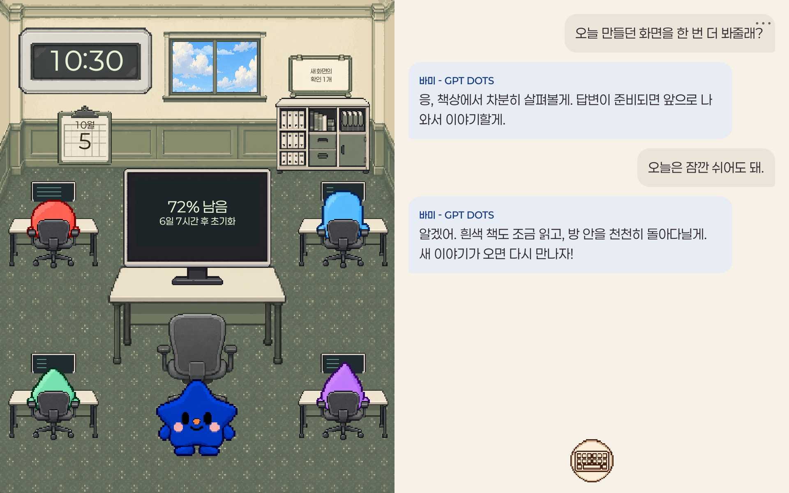 | 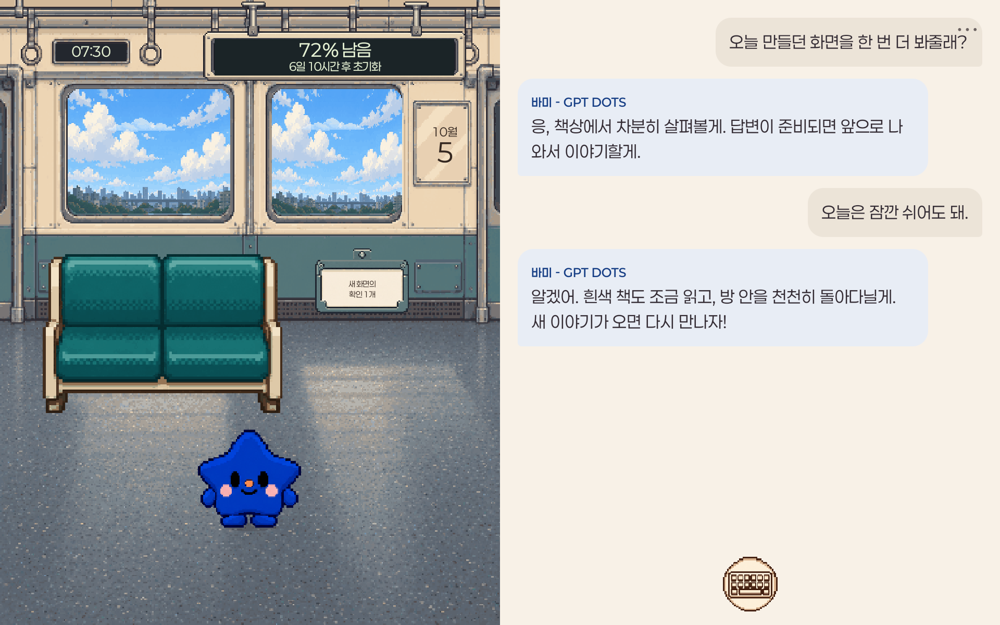 | 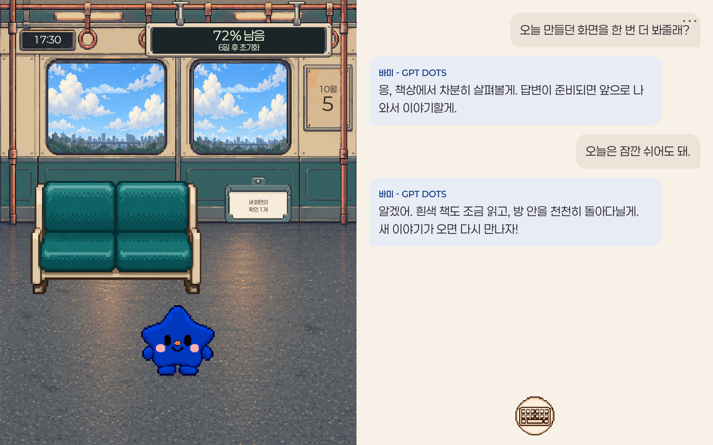 |

설정 시간대 기준 평일 **07–08시 아침 지하철 → 08–17시 회사 → 17–18시 저녁 지하철 → 그 외 집**입니다. 주말은 집에서 지냅니다. 회사에서는 동료들이 일하고, 커피를 마시고, 인사합니다. 캐릭터를 터치하거나 길게 눌러 집어 옮길 수도 있습니다.

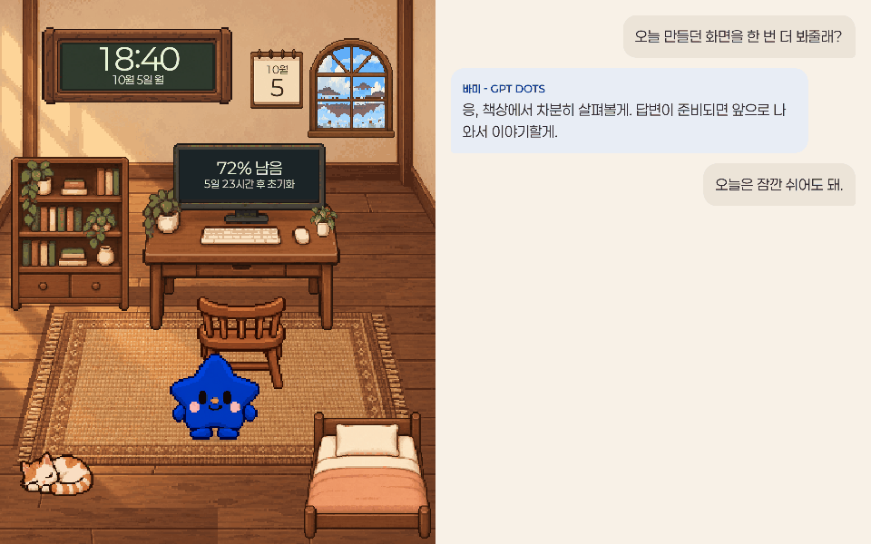

*합성 새 답변을 실제 renderer의 반짝임·말하기·생활 전환 경로로 재생했습니다. 고정 fixture 시각의 200ms 간격 native 캡처이며 성능 측정 영상은 아닙니다.*

## 빠르게 말하거나, 직접 입력하거나

| 두 번 터치해 빠른 대화 | 키보드로 직접 입력 |
|---|---|
| 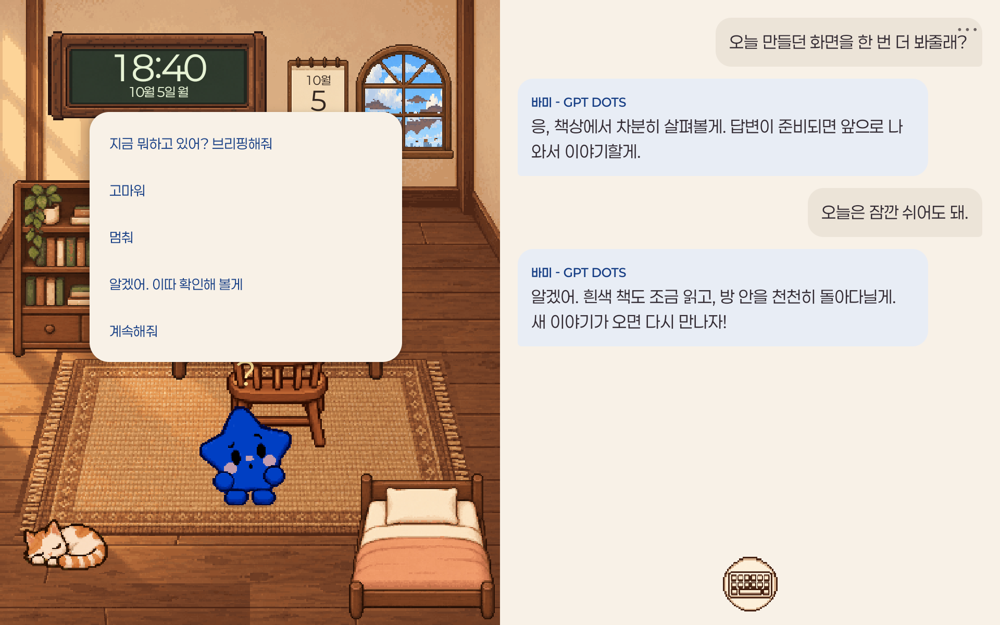 | 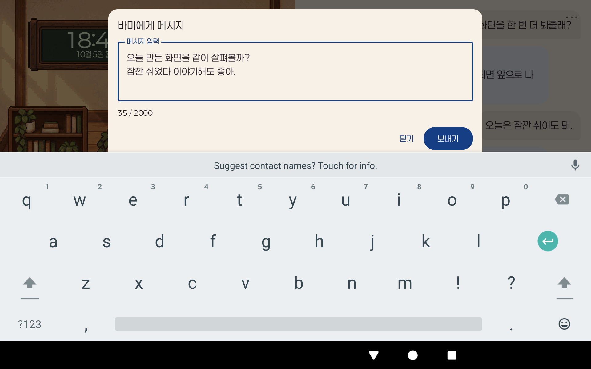 |

바미를 한 번 누르면 `?`와 궁금한 표정, 다시 누르면 다섯 가지 빠른 대화가 나타납니다. **브리핑해줘 / 고마워 / 멈춰 / 이따 확인할게 / 계속해줘**를 보낼 수 있습니다. 대화 아래의 동그란 키보드를 누르면 여러 줄을 직접 입력할 수 있습니다.

메시지는 지정한 Dots 웹 페이지의 입력창으로 전달합니다. 작성 중인 웹 초안을 보존하고, 실제 페이지에 새 사용자 메시지가 나타난 뒤 성공으로 판단합니다. 태블릿에는 수집된 결과만 표시합니다. 이미지 응답도 PNG로 전달해 말풍선에서 보고 확대할 수 있으며, 과거를 읽는 동안 자동 스크롤을 강제하지 않습니다.

## 방 안의 작은 위젯들

| 주간 한도·동기화·연결 설정 | Space 업무 메모 | 창밖 날씨 |
|---|---|---|
| 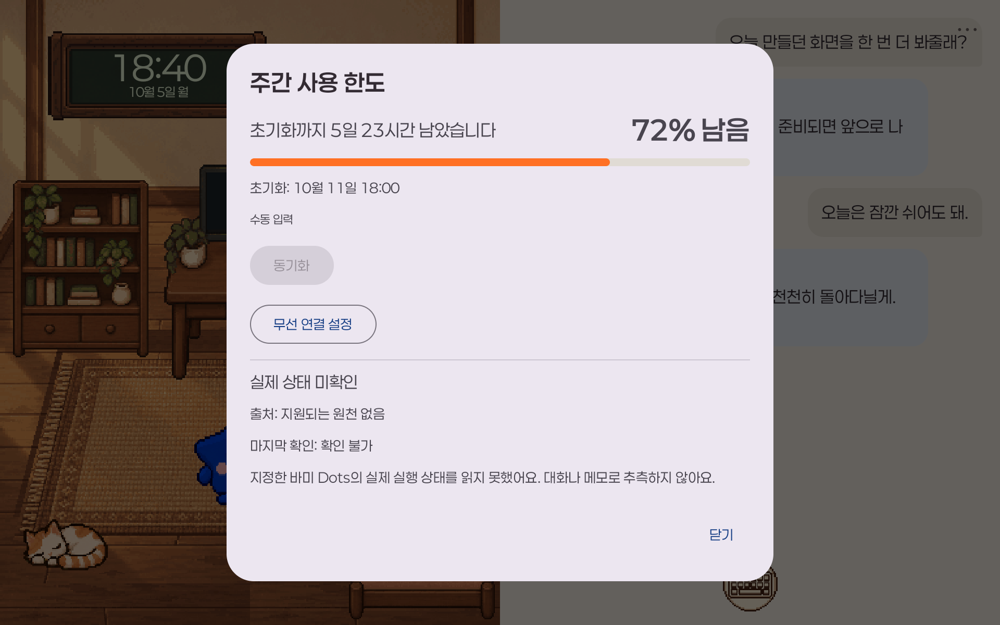 | 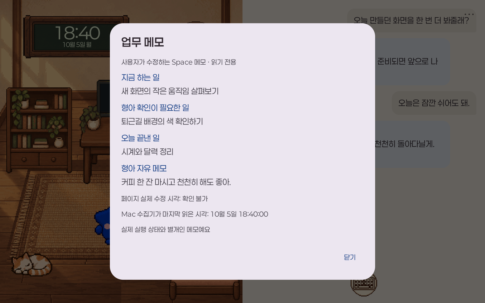 | 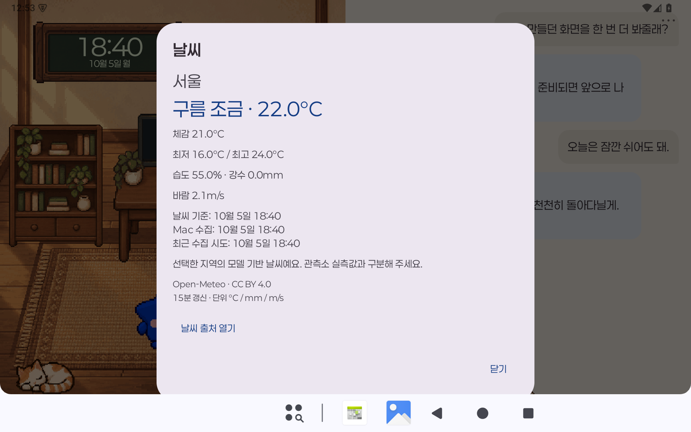 |

- **모니터**: 읽을 수 있는 Codex 계정의 주간 잔여 퍼센트와 초기화 시각, 수동 동기화, USB/Tailscale 설정.
- **책장·메모 오브젝트**: 사용자가 수정하는 전용 Space 업무 메모를 읽기 전용으로 표시.
- **시계·달력**: 장면 안에서도 보고, 누르면 크게 보기.
- **창문**: 선택 지역의 Open-Meteo 모델 날씨와 상세 정보. 기본 지역은 서울 대표 지점입니다.

알 수 없는 값·0·수동 예시·오래된 값을 구분합니다. Space에 ‘작업 중’이라고 적혀 있어도 실제 실행 상태로 취급하지 않습니다.

| 세로 상하 반반 | 세로 바미 전체 |
|---|---|
| 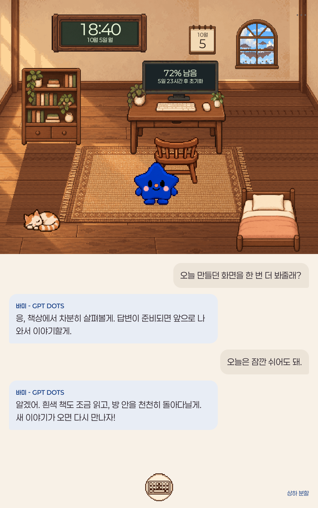 | 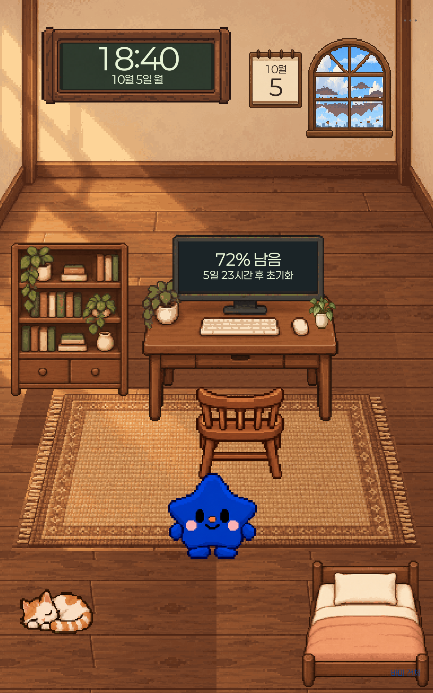 |

가로는 장면과 대화를 **50:50**으로 유지합니다. 세로는 **바미 전체 / 대화 전체 / 상하 분할**을 전환합니다. 바미 전체보기에는 대화창을 겹쳐 넣지 않습니다.

## 집 밖에서도, 태블릿의 Dots 공간에서

컴퓨터를 켜 두고 브리지와 로그인된 **Ego Browser**를 유지하면 Tailscale로 같은 공간을 밖에서도 사용할 수 있습니다. 태블릿만 들고 다니며 일반 GPT 앱 대신 이 작은 Dots 공간에서 이야기하는 방식입니다. 선택한 태블릿의 사설 연결과 앱 인증을 함께 사용합니다. [설치와 Tailscale 설정](docs/setup.md)을 참고하세요.

현재 수집은 **로그인된 Ego Browser에 표시된 대화**를 읽습니다. 일반 브라우저 로그인만으로 바로 연결되지 않습니다. 공식 Dots API 어댑터는 **NOT_IMPLEMENTED**이고 실제 Dots 실행 상태의 지원도 확인되지 않았습니다. 이미 표시된 최근 50개부터 수집하며 전체 과거 기록을 자동으로 불러오지 않습니다. 화면 깨우기는 구현되어 있지만 Android 전원 절약·VPN·백그라운드 제한에 영향을 받습니다. 주간 한도는 **Codex 계정 한도**이며 Dots 전용 한도라는 뜻이 아닙니다.

## 내 캐릭터로 바꾸기

본인의 참조 이미지에서 스프라이트 시트를 만들고 atlas·manifest를 맞추면 다른 캐릭터를 적용할 수 있습니다. **96×96 RGBA 셀, 방향별 보행, 발 anchor, 프레임 시간, 가구 레이어**를 함께 준비해야 합니다. [캐릭터 팩 안내](docs/characters.md)와 [생성 프롬프트](docs/sprite-prompts.md)에 호흡·깜박임·둘러보기·말하기·독서·후면 컴퓨터 작업·수면·집어 들기·반짝임 제작 기준을 정리했습니다. 원본 Codex PET을 바꾸는 기능은 없습니다.

## 실행과 구조

Node 24, JDK 17, Android SDK 35, Python/Pillow가 필요합니다.

```bash
python3 -m venv .venv
source .venv/bin/activate
pip install -r requirements.txt
npm ci --ignore-scripts
npm run build
npm test
npm run assets:prepare
npm run assets:check
apps/android/gradlew -p apps/android :app:assembleDebug
```

앱내 데모는 계정 없이 사용할 수 있습니다. 실제 연결은 [설치 안내](docs/setup.md)의 로컬 설정·명시적 페어링 절차를 따릅니다. `config.local.json`, 브라우저 로그인과 자격 증명은 공개 저장소에 넣지 않습니다.

```text
apps/android/      Kotlin / Compose 태블릿 앱
bridge/            TypeScript 인증 WS·브라우저 어댑터
protocol/          v2 계약·합성 fixture
assets/            캐릭터·장면·UI 원본과 manifest
tests/             브리지 회귀 검사
tools/            실행·페어링·자산·공개 감사
docs/             설정·생성 프롬프트·화면·검증
```

코드와 문서는 [MIT](LICENSE), 제공 그림 자산은 [CC BY-NC 4.0](assets/LICENSE), 페이퍼로지 글꼴은 [SIL OFL 1.1](licenses/Paperlogy-OFL.txt)입니다. [제3자 고지](THIRD_PARTY_NOTICES.md)를 확인하세요. OpenAI·ChatGPT·Codex·Tailscale의 공식 제품은 아닙니다. 첫 공개에는 소스·문서·자산만 포함하며 개인 설치 APK, Mac 배포 ZIP, GitHub Pages는 제공하지 않습니다.
